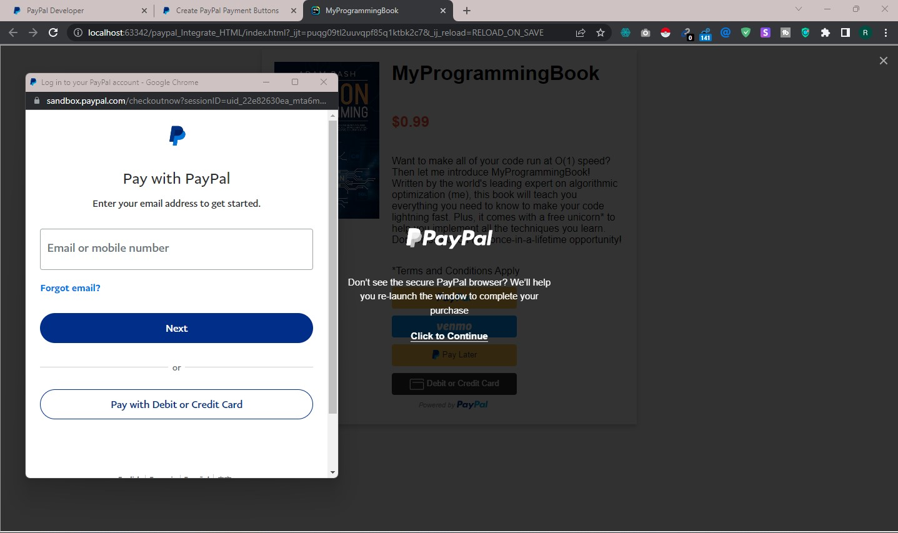

## 🚀 About Me
I'm a full stack developer...

# PayPal Payment Integration

Integrating PayPal into your own HTML/CSS/JS product pages can greatly improve the user experience and streamline the checkout process for your customers.


## Screenshots


## Run Locally

Clone the project

```bash
  git clone https://github.com/SOUROVSARKERTEC12/paypal_Integrate_HTML
```

Go to the project directory

```bash
  cd paypal_Integrate_HTML
```

## Feedback

If you have any feedback, please reach out to us at sourovsarker005@gmail.com
